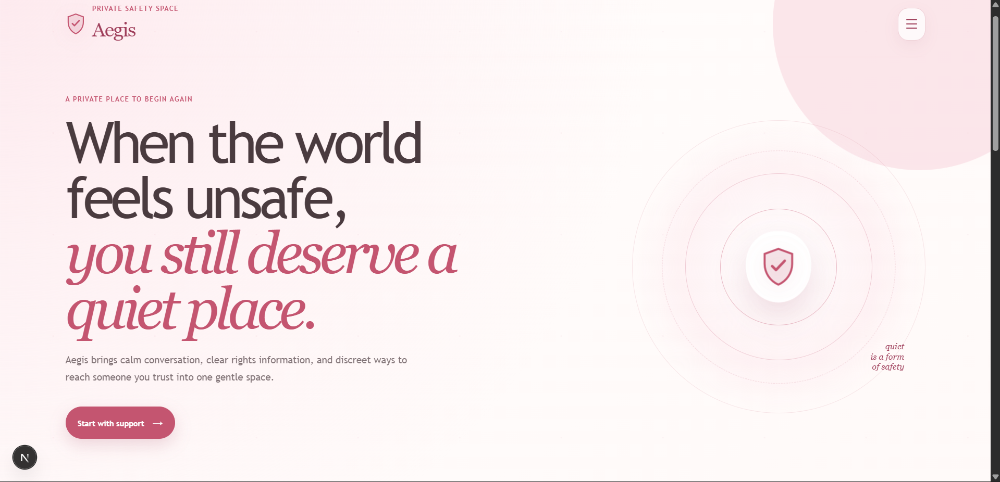

# Aegis

<div align="center">
  
</div>

**A stealth safety and support companion designed to protect.**

---

## 🚨 The Problem

When the world feels unsafe, reaching out for help shouldn't put you in more danger. For individuals facing abuse, monitoring, or isolation, openly searching for assistance or making a visible distress call is often impossible. Furthermore, critical support—whether emotional guidance, legal information, or emergency contact—is fragmented across different platforms, making it hard to access in high-stress, low-bandwidth, or strictly monitored environments.

## 🛡️ The Solution: Aegis

Aegis is a private, zero-cost safety toolkit disguised as a simple, functioning calculator on your device. Behind this unassuming facade lies a powerful suite of support tools. By entering a secret PIN, the calculator transforms into a secure space where users can access discreet SOS communication, emotional support, legal guidance, and health information. Aegis is built on a privacy-first, offline-resilient architecture that ensures a person can choose the safest next step without leaving a trace.

---

## ✨ Features

Aegis is packed with features designed specifically for stealth and safety:

### 1. 🧮 Stealth Calculator Disguise
The application initially opens as a fully functional calculator. Only by entering a specific, configured unlock code (e.g., `2580`) and pressing `=` does the real Aegis toolkit reveal itself. A quick tap of `Escape` or the "Quick Exit" button immediately reverts the app back to the calculator, clearing all session data instantly.

### 2. 🖼️ Discreet SOS via Steganography
Send an SOS without anyone knowing. Users can type a short distress phrase and select an ordinary cover theme (like a flower or sunset). Aegis uses AI to expand the phrase into a full distress message and hides it invisibly inside a generated cover image using lossless LSB steganography. This innocent-looking image can then be shared directly with trusted contacts.

### 3. 💬 AI Companion (Emotional Support)
A warm, always-available AI chatbot that provides emotional support, grounding techniques, and coping strategies. It adapts contextually to your messages, supports voice read-aloud via browser TTS, and actively avoids giving inappropriate medical or legal advice. If urgent language is detected, it gently surfaces real crisis resources.

### 4. ⚖️ India-Scoped Legal Rights RAG Bot
Navigate your legal rights with confidence. A specialized chatbot grounded in a curated corpus of Indian Domestic Violence laws (PWDVA, BNS, etc.). Instead of guessing, it retrieves relevant passages using Vector Search and provides cited, accurate answers to legal queries.

### 5. 🩺 Health Assistant
Get direct, judgment-free answers to intimate health questions concerning symptoms, sexual health, periods, contraception, and more, while clearly highlighting warning signs that require professional medical attention.

### 6. 🚨 Responder Dashboard
A dedicated workspace for trusted contacts or NGOs. Responders can upload a received SOS cover image to instantly decode the hidden distress message, view AI-assigned severity scores, and manage cases in order of urgency.

### 7. 📞 Trusted-Contact Voice Bridge & Email Queue
If direct communication is unsafe, Aegis can relay a live voice explanation to a trusted contact or queue help emails locally. If the internet drops, requests are saved and automatically retried once connectivity returns.

### 8. 🔒 Private Direct Messaging
Secure, one-to-one messaging between authenticated users with offline-resilient history and realtime WebSocket updates.

---

## 🛠️ Tech Stack

Aegis is built on a modern, **zero-cost** architecture to ensure it remains accessible to everyone.

**Frontend:**
- **Framework:** Next.js 16 (App Router)
- **Language:** TypeScript & React 19
- **Styling & Animation:** Tailwind CSS, GSAP, Lenis
- **Auth:** Clerk
- **Browser APIs:** Web Speech API (TTS), native sharing, clipboard

**Backend:**
- **Framework:** FastAPI (Python 3.12)
- **Server:** Uvicorn
- **AI / LLM:** Groq API (`llama-3.3-70b-versatile`)
- **Embeddings:** `sentence-transformers/all-MiniLM-L6-v2` (Local)
- **Steganography:** Custom pure Python LSB implementation
- **Database / Vector Store:** MongoDB Atlas M0 (Free Tier) & SQLite

---

## 🚀 Setup Instructions

### Prerequisites
- Node.js (v18+)
- Python (v3.12+)
- API Keys for Groq, MongoDB Atlas, and Clerk (for full functionality)

### 1. Backend Setup

Open a PowerShell terminal and navigate to the backend directory:

```powershell
cd D:\MyCodes\Aegis\aegis\backend
```

Run the backend server (assuming the virtual environment is already set up as per the old readme):

```powershell
.venv\Scripts\uvicorn.exe main:app --host 127.0.0.1 --port 8123
```
*(Ensure you have configured provider keys in `backend/.env`).*

### 2. Frontend Setup

Open a second PowerShell window and navigate to the frontend directory:

```powershell
cd D:\MyCodes\Aegis\aegis\frontend
```

Install the required packages and start the Next.js development server:

```powershell
npm install
npm run dev
```
*(Ensure you have configured frontend public settings in `frontend/.env.local`).*

### 3. Usage
- Open your browser and go to the Next.js URL, usually `http://localhost:3000`.
- You will see the calculator. Type `2580` and hit `=` to unlock the Aegis dashboard!
